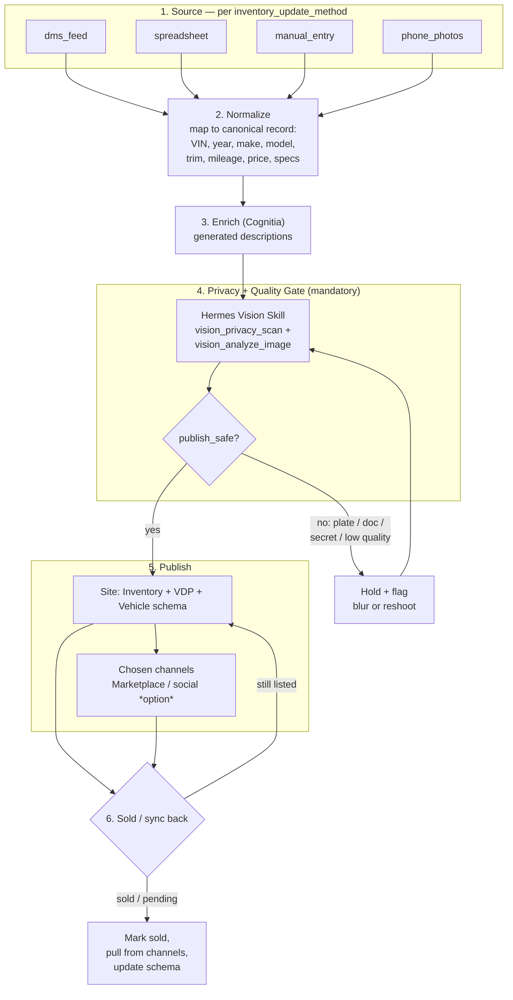

# Inventory Automation — Deliverable #5

**For:** [Dealership name] · **Prepared by:** Demandara (powered by Cognitia)
**Date:** [date] · **Module:** Auto Growth OS #2 (inventory that publishes itself)

> Guardrails: this is a workflow spec with no live wiring; every photo
> passes a mandatory privacy + quality gate before publish and any price
> or value claim is `[REQUIRES HUMAN APPROVAL]`. See `../internal/guardrails.md`.

---

## What this document is

The build spec for the inventory ingest-to-publish workflow — the second
module of the Auto Growth OS (`../proposal/03-auto-growth-os-offer.md`).
Stock flows from wherever it lives today, gets normalized and enriched,
passes a mandatory privacy and quality gate, then publishes to the
website and the channels you choose — and syncs back when a vehicle
sells.

It is **specification, not provisioning.** No CRM, Zapier, Make,
Marketplace, or social account is wired up here. Every third-party tool
named below is an option to evaluate (guardrail: no live wiring).

## The one rule that gates everything

**No image goes live until it passes the privacy + quality gate.** The
gate is the existing Hermes Vision Skill (`hermes/skills/vision-skill/`),
used as a supporting publish-safety artifact. It is not the platform and
is not modified by this engagement.

---

## Pipeline overview

---

## Stage by stage

### 1. Source — by `inventory_update_method`

The entry point is set by the discovery `inventory_update_method` field.
The downstream stages are identical; only ingest differs.

| `inventory_update_method` | How stock enters                          |
| ------------------------- | ----------------------------------------- |
| `dms_feed`                | Scheduled pull/export from the DMS feed   |
| `spreadsheet`             | Watched spreadsheet (one row per vehicle) |
| `manual_entry`            | Form-based entry into a canonical record  |
| `phone_photos`            | Phone-captured photos + minimal fields, enriched later |

`phone_photos` leans hardest on the gate and on enrichment, because raw
phone captures are the most likely to contain plates, paperwork, or
reflections of people.

### 2. Normalize

Every source maps to one canonical vehicle record so the rest of the
pipeline is source-agnostic: VIN/stock, year, make, model, trim,
mileage, drivetrain, fuel/EV, transmission, color, features, price,
status, and the photo set. Facets shown on the site
(`04-website-blueprint.md`) come from these fields and follow
`dealership_type` (`new` / `used` / `both` / `specialty`).

Price is carried as data. Any payment, financing, or trade-in framing
derived from it is `[REQUIRES HUMAN APPROVAL]`.

### 3. Enrich (Cognitia)

Two Cognitia steps, both producing drafts a human can edit:

- **Photo QC** — the privacy + quality pass (stage 4, below), run via
  the existing Hermes Vision Skill.
- **Generated descriptions** — a factual draft per vehicle from the
  normalized record. No invented features, no fabricated history
  (guardrail #7). No payment, APR, or "approved" language; no trade-in
  value. Anything in that territory is `[REQUIRES HUMAN APPROVAL]`.

### 4. Privacy + quality gate (mandatory)

Run on every image before it can publish, using
`hermes/skills/vision-skill/` (see that folder's `README.md`). The skill
is read-only: it never deletes, never posts, never publishes.

- `vision_privacy_scan` — OCR + regex, no LLM required. Flags emails,
  phone numbers, API keys/tokens, account names, file paths, and
  financial data, and returns `blur_recommendations` and a `publish_safe`
  boolean. If a token/API key/financial-looking digit is visible,
  `publish_safe` is forced to `false`.
- `vision_analyze_image` — `quality_score`, `privacy_risks`,
  `detected_text`, and a `recommended_action` for low-quality or
  risky shots (e.g. a visible plate, a document, paperwork on the seat).

Decision: if `publish_safe` is false or quality is below bar, the image
is **held and flagged** for blur or reshoot and re-run — it does not go
live. Only `publish_safe` images with acceptable quality pass. This gate
is the single hard stop in the pipeline.

### 5. Publish

- **Site first.** Passing vehicles publish to the Inventory listing and
  a per-vehicle VDP, carrying `Vehicle` schema
  (`04-website-blueprint.md`).
- **Then chosen channels.** Marketplace and social are *options the
  dealer selects*, not wired here. Each gated image and the listing copy
  flow out under the same rules. No spam, consent-first where channels
  require it (guardrail #6).

### 6. Sold / sync back

When a vehicle sells or goes pending, the change propagates: mark
sold/pending on the site, pull the listing from channels, and update
`Vehicle` schema and availability — so no sold car keeps drawing
inquiries. Still-listed vehicles stay published and re-sync on the next
source pull.

---

## Automation-level ladder

Pick a level off `inventory_size` and `inventory_update_method`. Higher
levels automate more of the same pipeline — the gate is mandatory at
every level.

| Level        | Fits                                              | Source → normalize | Enrich          | Publish + sync-back        |
| ------------ | ------------------------------------------------- | ------------------ | --------------- | -------------------------- |
| **Basic**    | `under_50`; `manual_entry` / `phone_photos`       | Manual / form entry | Descriptions on request; gate on every photo | Manual publish to site; channels by hand |
| **Standard** | `50_200` / `200_500`; `spreadsheet`               | Watched spreadsheet, scheduled normalize | Auto descriptions; gate on every photo | Auto-publish to site; assisted channel push; sold-flag sync |
| **Advanced** | `200_500` / `500_plus`; `dms_feed`               | Scheduled DMS feed pull, auto normalize | Auto descriptions; gate on every photo | Auto-publish site + channels; automated sold/sync-back |

Two reads of the same table:

- **By `inventory_size`:** `under_50` rarely needs more than Basic;
  `50_200`/`200_500` is the Standard sweet spot; `500_plus` needs
  Advanced to stay current without manual re-entry.
- **By `inventory_update_method`:** `manual_entry`/`phone_photos` start
  at Basic; `spreadsheet` unlocks Standard; `dms_feed` is the
  precondition for Advanced.

The gate does not scale away. At every level, no image publishes until
it passes.

---

## Tool options to evaluate

Options to assess during build — **not provisioned, not wired** (no live
wiring, per guardrails). The dealer and Demandara choose during kickoff.

| Option       | Role under evaluation                         | Status            |
| ------------ | --------------------------------------------- | ----------------- |
| **Zapier**   | Trigger/connector glue between source, gate, publish | OPTION — not provisioned |
| **Make**     | Visual multi-step orchestration alternative   | OPTION — not provisioned |
| **Supabase** | Canonical inventory store / status + sync-back | OPTION — not provisioned |

Selection criteria: volume (`inventory_size`), source type
(`inventory_update_method`), channel count, and how much the dealer wants
to self-serve. The Hermes Vision Skill gate is a fixed supporting
artifact regardless of which orchestration option is chosen.

---

## Guardrail checklist for this workflow

- Privacy + quality gate runs on **every** image before publish; held
  images do not go live.
- No plates, documents, secrets, or low-quality shots published
  (`vision_privacy_scan` / `vision_analyze_image`).
- Generated descriptions are factual drafts; no invented features or
  history.
- No price-derived payment, financing, or trade-in claim ships without
  `[REQUIRES HUMAN APPROVAL]`.
- Hermes Vision Skill is referenced, not modified; it is read-only and
  never publishes on its own.
- Marketplace/social and Zapier/Make/Supabase are options to evaluate,
  with no live wiring.

## Handoffs

- **Website →** publishes onto Inventory, VDPs, and `Vehicle` schema:
  `04-website-blueprint.md`.
- **Intake →** inquiries from published listings route here:
  `06-whatsapp-telegram-intake.md`.
- **Pipeline →** captured leads land here: `07-crm-lite-pipeline.md`.
- **Vision Skill →** the publish-safety gate:
  `../../../hermes/skills/vision-skill/README.md`.
