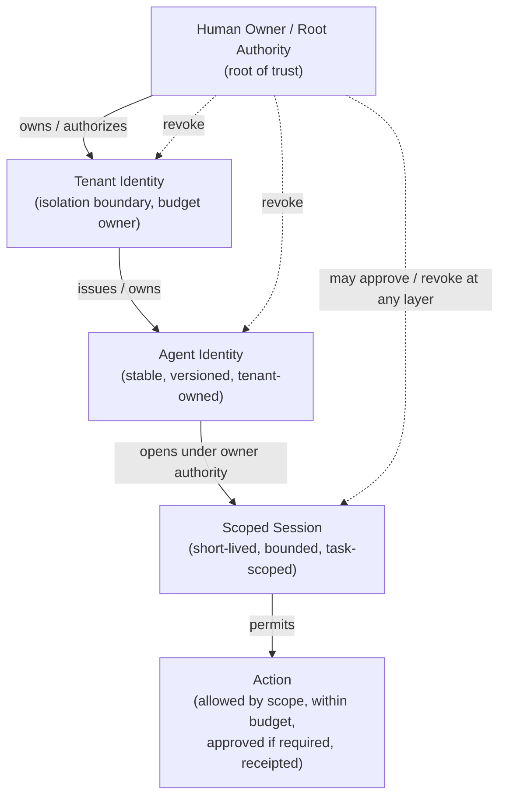
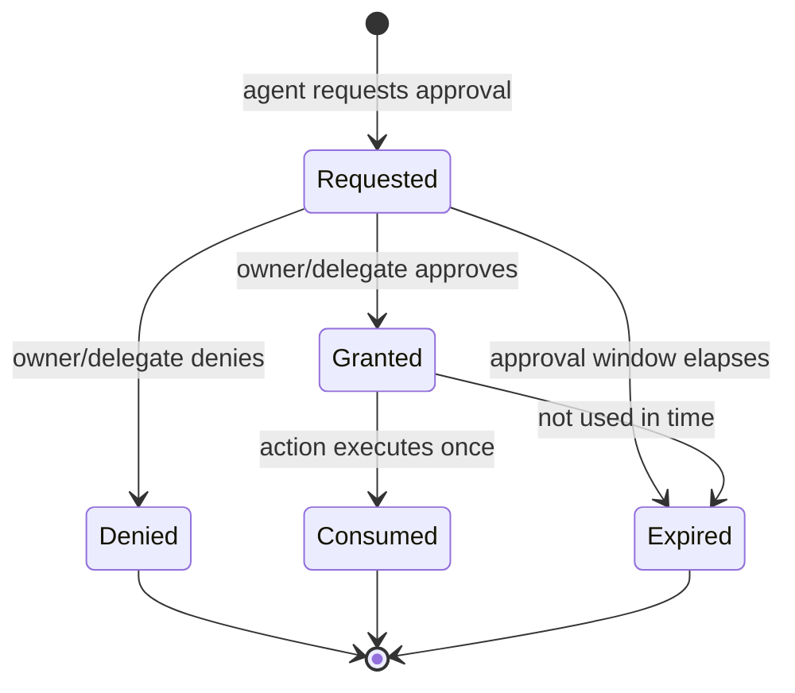

# Cognitia Agent Passport

> Status: Draft architecture specification (design-only).
> Scope: Internal authority model for autonomous agents acting inside Cognitia.
> This document specifies formats and rules. It is **not** product code and introduces
> **no** runnable implementation.

## 1. Overview & Core Principle

The **Agent Passport** is the internal authority model that governs what an autonomous agent is
allowed to do inside Cognitia, on behalf of a tenant and a human owner. A Passport binds an
**agent identity** to a **tenant identity** under a **human root authority**, and constrains every
action the agent takes through **scoped sessions**, **explicit budgets**, **approval gates**, and
**revocation**.

**Core principle:**

> **Cognitia grants scoped action authority before any financial authority.**

An agent earns the ability to *do things* (read, write, call internal tools) through least-privilege
action scopes that are explicitly granted, bounded, audited, and revocable. Financial authority is
**not** part of this model and is **not** granted by the Passport. No part of the Passport is a
token, a balance, or a transferable instrument. The Passport is internal permissions plumbing only.

This document is the foundational identity/authorization specification for Cognitia. It defines the
canonical vocabulary (agent, tenant, owner, session, scope, budget, approval, revocation, receipt,
audit event) used by everything built later.

## 2. Non-Goals / Out of Scope

The Agent Passport deliberately introduces **none** of the following. They are explicitly out of
scope and MUST NOT be added under cover of this model:

- **No public token.** No mintable, transferable, or tradable token of any kind.
- **No wallet** or key-custody surface for value.
- **No stablecoin, chain, or on-chain settlement.**
- **No liquidity, listing, presale, yield, staking, or investment surface.**
- **No money movement.** The Passport never authorizes a payment, transfer, or settlement.
- **No external/public identity issuance.** Passports are internal to Cognitia; they are not a
  public credential, login provider, or federation root for third parties.

The **cost budget** defined in §7 is an **internal accounting unit** for compute/usage governance.
It is deliberately *not* a currency, *not* a balance, and *not* redeemable or transferable. It
exists so an agent can be throttled by resource consumption, nothing more.

If financial authority is ever introduced in Cognitia, it MUST be a **separate, downstream authority
layer** that depends on — and is gated by — the action authority defined here. See §12.

## 3. Identity Model

Three identities and one derived grant form the chain of authority. Each lower layer can only ever
hold a subset of the authority of the layer above it.



**Authority subset rule (MUST):** a session's effective authority is the **intersection** of the
agent's Passport scope, the tenant's policy, and any per-session narrowing. A child can never widen
beyond its parent.

### 3.1 Agent Identity

An **agent** is a non-human actor (an autonomous worker, a skill runtime, an MCP tool host, etc.).
Each agent has a stable identity issued by exactly one tenant.

| Field | Meaning |
| --- | --- |
| `agent_id` | Stable, opaque, unique identifier. Never reused. |
| `agent_class` | Logical type/role of the agent (e.g. `vision-qc`, `research`). |
| `agent_version` | Version of the agent code/config bound to this identity. |
| `tenant_id` | The owning tenant. Immutable for the life of the agent. |
| `provenance` | How the identity was created: who issued it, when, from what source/commit. |
| `status` | `active` \| `suspended` \| `revoked`. |

Rules:

- An `agent_id` MUST belong to exactly one `tenant_id` and MUST NOT be moved between tenants.
- Changing `agent_version` does not change `agent_id`; provenance records the version transition.
- An agent has **no inherent authority**. It can only act through a scoped session (§4).

### 3.2 Tenant Identity

A **tenant** is the isolation and ownership boundary. All agents, budgets, sessions, approvals,
receipts, and audit events belong to exactly one tenant.

| Field | Meaning |
| --- | --- |
| `tenant_id` | Stable, opaque, unique identifier. |
| `owner_principal` | The human root authority for this tenant (§3.3). |
| `policy` | Tenant-wide scope ceiling, default budgets, and approval rules. |
| `status` | `active` \| `suspended` \| `revoked`. |

Rules:

- **Isolation (MUST):** an agent or session belonging to tenant A MUST NOT read, write, or affect
  any resource, budget, receipt, or audit event of tenant B. Cross-tenant access is a prohibited
  action (§6) regardless of scope.
- The tenant `policy` is a **ceiling**: no agent or session under the tenant may hold a scope or
  budget greater than the tenant policy allows.
- Budgets (§7) are owned and aggregated at the tenant level and sub-allocated to agents/sessions.

### 3.3 Human Owner / Root Authority

Every tenant has a **human owner** who is the **root of trust**. Authority flows downward from this
human; no agent can originate authority.

The human owner (or a human **delegate** the owner has explicitly authorized) is the only party that
may:

- **Issue** a Passport / create an agent identity, or widen an existing scope.
- **Approve** actions that require approval (§8).
- **Revoke** a session, an agent, or the tenant (§9).
- **Authorize a delegate**, and define the bounds of that delegation.

Rules:

- **No self-escalation (MUST):** an agent MUST NOT grant itself authority, widen its own scope,
  approve its own actions, or extend its own budgets. Every authority increase requires a human
  (owner or authorized delegate).
- Delegation is itself a subset relationship: a delegate's authority MUST be a subset of the owner's
  and is recorded in provenance and audit.
- Root authority actions (issue, widen, approve, revoke, delegate) are themselves audited (§11).

## 4. Scoped Session

An agent never acts "as itself" with standing authority. Instead, the owner authority opens a
**scoped session**: a short-lived, bounded grant derived from the agent's Passport and frozen at
issue time.

| Field | Meaning |
| --- | --- |
| `session_id` | Stable, opaque, unique identifier for this session. |
| `agent_id` | The parent agent acting in this session. |
| `tenant_id` | The owning tenant (denormalized for isolation checks). |
| `issued_at` / `expires_at` | Validity window. Sessions are short-lived by default. |
| `scope` | The allowed action scopes (§5), **frozen at issue time**. |
| `budgets` | The action / rate / cost budgets allotted to this session (§7). |
| `task_context` | The single task/purpose this session is bound to. |
| `approval_policy` | Which actions in this session require approval (§8). |
| `status` | `active` \| `expired` \| `revoked`. |

Rules:

- **Subset (MUST):** a session's `scope` and `budgets` MUST be a subset of the issuing agent's
  Passport, which is itself a subset of tenant policy.
- **Freeze (MUST):** the session's authority is fixed at `issued_at`. Later widening of the agent's
  Passport does not retroactively widen an open session.
- **Single purpose (SHOULD):** a session SHOULD be bound to one `task_context`. Reuse across
  unrelated tasks is discouraged; open a new session instead.
- **Expiry (MUST):** once `expires_at` passes, the session is invalid and every action is denied.
- **No action without a valid session (MUST):** an agent with no `active` session has zero
  authority.

```json
{
  "session_id": "ses_01J...",
  "agent_id": "agt_01H...",
  "tenant_id": "tnt_01F...",
  "issued_at": "2026-06-21T14:00:00Z",
  "expires_at": "2026-06-21T14:30:00Z",
  "scope": ["read:dataset", "write:report"],
  "budgets": { "action": 50, "rate": "30/min", "cost": 1000 },
  "task_context": "summarize-batch-4821",
  "approval_policy": { "delete:dataset": "required" },
  "status": "active"
}
```

## 5. Allowed Actions

Authority is expressed as named **action scopes**: a verb over a resource type, scoped to the
tenant. The model is **least-privilege, default-deny**.

- **Shape:** `verb:resource_type`, e.g. `read:dataset`, `write:report`, `invoke:tool`.
- **Default deny (MUST):** if an action is not explicitly covered by a granted scope in the current
  session, it is denied. There is no implicit or ambient authority.
- **Composition:** a session's effective allowed set is the union of its granted scopes, then
  intersected with the agent Passport and tenant policy ceilings (§3 subset rule).
- **Granularity (SHOULD):** scopes SHOULD be narrow (specific resource types, specific verbs) rather
  than broad wildcards. Wildcards, if ever used, MUST be bounded by tenant policy.
- **Read vs. mutate:** read scopes never imply write scopes. Mutating actions additionally consume
  the action budget and may require approval (§7, §8).

Examples of well-formed allowed actions:

| Scope | Permits |
| --- | --- |
| `read:dataset` | Read tenant-owned datasets the session is bound to. |
| `write:report` | Create/update reports within the task context. |
| `invoke:tool` | Call an internal/MCP tool the session is permitted to use. |
| `read:receipt` | Read receipts the session/agent produced (own-scope only). |

## 6. Prohibited Actions

The following are **hard-denied regardless of any granted scope**. A session that attempts them MUST
be denied and the attempt MUST be recorded as an audit event (§11).

- **Any financial authority.** Initiating or authorizing a payment, transfer, settlement, token
  mint/transfer, or any value movement. The Passport carries no financial authority to grant.
- **Scope self-escalation.** An agent widening its own scope, extending its own budgets, approving
  its own actions, or issuing/altering Passports.
- **Cross-tenant access.** Reading, writing, or affecting any resource, budget, receipt, or audit
  event outside the session's `tenant_id`.
- **Acting without a valid session.** Any action when no `active`, unexpired, unrevoked session
  applies.
- **Acting outside frozen scope.** Any action not in the session's `scope` frozen at issue time.
- **Bypassing approval.** Executing an approval-required action (§8) without a valid, unconsumed
  approval.
- **Operating after revocation.** Continuing any in-flight action after the session, agent, or
  tenant has been revoked (§9).
- **Tampering with receipts or audit events.** Receipts and audit events are append-only; agents may
  not edit, delete, or backdate them.

## 7. Budgets

Every session carries three **independent** budgets, enforced per session and aggregated upward to
the agent and tenant. Budgets are a containment mechanism, not an entitlement: exhausting a budget
denies further action; it never grants anything.

| Budget | Unit | Enforcement point | Exhaustion behavior |
| --- | --- | --- | --- |
| **Action budget** | Count of mutating actions | Before each mutating action | Deny further mutating actions; session may continue read-only until other limits hit. |
| **Rate budget** | Actions per time window (e.g. `30/min`) | Before each action (sliding window) | Throttle: deny/queue until the window refills. |
| **Cost budget** | **Internal compute/usage accounting units** (NOT money, NOT a token, NOT redeemable or transferable) | Before/after each costed action | Deny further costed actions once the unit allotment is consumed. |

Rules:

- **Independence (MUST):** the three budgets are checked independently; hitting any one denies the
  relevant class of action even if the others have headroom.
- **Subset (MUST):** session budgets are sub-allocations of agent and tenant budgets and can never
  exceed them.
- **No agent top-up (MUST):** an agent MUST NOT increase its own budgets. Only the human owner (or
  delegate) may allot more, and that is an audited authority action (§11).
- **Cost is not currency (MUST):** the cost unit exists solely to govern resource consumption. It
  has no monetary meaning, no exchange rate, and no transfer mechanism. It MUST NOT be presented or
  treated as a balance, credit, or financial instrument.
- **Every budget consumption is receipted (§10) and audited (§11).**

## 8. Approval Requirement

Some actions are too consequential to run on standing scope alone and require **human approval**
before execution. The session's `approval_policy` declares which.

Approval state machine:



Rules:

- **Human grant only (MUST):** only the human owner or an authorized delegate may grant approval. An
  agent MUST NOT approve its own (or another agent's) actions.
- **Per-action and single-use (MUST):** an approval authorizes **one** specific action instance. It
  is `Consumed` on execution and cannot be reused.
- **Non-transferable (MUST):** an approval is bound to its `session_id` + action and MUST NOT be
  moved to another session, agent, or action.
- **Expiry (MUST):** an unused approval expires; an expired or denied approval blocks the action.
- **Receipted + audited:** request, grant/deny, and consumption each emit a receipt (§10) and audit
  event (§11), carrying the approval reference.

## 9. Revocation

Revocation is the owner authority's immediate override. It always wins over any cached or in-flight
grant.

Revocation targets, from narrow to broad:

- **Session revocation** — invalidates one session; all its in-flight and future actions are denied.
- **Agent revocation** — invalidates the agent and **all** its sessions.
- **Tenant revocation/suspension** — invalidates the tenant and **all** its agents and sessions.

Rules:

- **Immediate effect (MUST):** once revoked, the target's `status` becomes `revoked` and every
  subsequent authority check MUST fail. No grace period for new actions.
- **In-flight propagation (MUST):** actions already started MUST stop at the next authority
  checkpoint; partial work MUST be receipted as interrupted.
- **Revocation beats cache (MUST):** any cached session/scope/budget decision is overridden by a
  revocation. Caches MUST honor a revocation signal before authorizing further actions.
- **Tombstoning (MUST):** revoked identifiers are **never reused**. The revoked record is retained
  (tombstoned) for audit; the `agent_id`/`session_id`/`tenant_id` is permanently retired.
- **Revocation is itself audited (§11)**, recording who revoked, what, when, and why.

## 10. Receipt Format

Every consequential action (mutating action, budget consumption, approval lifecycle step, revocation
effect) emits an **internally-signed, append-only receipt**. Receipts are the per-action record;
audit events (§11) are the canonical stream they map into.

| Field | Meaning |
| --- | --- |
| `receipt_id` | Unique, opaque receipt identifier. |
| `session_id` | Session under which the action ran. |
| `agent_id` | Acting agent. |
| `tenant_id` | Owning tenant (for isolation checks). |
| `action` | The attempted action (`verb:resource_type`). |
| `resource` | The specific resource reference acted on. |
| `decision` | `allowed` \| `denied`. |
| `reason` | Why allowed/denied (scope hit, budget exhausted, no approval, revoked, etc.). |
| `budget_deltas` | `{ action, rate, cost }` consumed by this action. |
| `approval_ref` | Reference to the approval consumed, if the action required one. |
| `outcome` | Result/status of execution (`ok`, `error`, `interrupted`). |
| `timestamp` | UTC time of the decision. |
| `prev_hash` | Hash of the previous receipt in the chain (tamper-evident linkage). |
| `hash` | Hash over this receipt's contents + `prev_hash`. |

```json
{
  "receipt_id": "rcp_01K...",
  "session_id": "ses_01J...",
  "agent_id": "agt_01H...",
  "tenant_id": "tnt_01F...",
  "action": "write:report",
  "resource": "report/summarize-batch-4821",
  "decision": "allowed",
  "reason": "scope:write:report; budget:ok",
  "budget_deltas": { "action": 1, "rate": 1, "cost": 12 },
  "approval_ref": null,
  "outcome": "ok",
  "timestamp": "2026-06-21T14:03:11Z",
  "prev_hash": "sha256:9c1f...",
  "hash": "sha256:4ab8..."
}
```

Rules:

- **Append-only + tamper-evident (MUST):** receipts are chained via `prev_hash`/`hash`. They are
  never edited, deleted, or backdated.
- **Internal signing (MUST):** "signed" here means an internal integrity/authenticity mechanism. It
  is **not** a blockchain, not a public ledger, and carries no token or value.
- **Redaction (MUST):** receipts MUST NOT embed secrets or raw PII. Consistent with the existing
  vision-skill audit-redaction pattern, sensitive values (emails, phone numbers, API keys/tokens,
  financial digits, file paths) are redacted/hashed before a receipt is written.

## 11. Audit Event Mapping

Each lifecycle event maps to a canonical **audit event type**. The audit stream is the
tenant-scoped, append-only system of record; receipts (§10) are the per-action artifacts referenced
from it.

| Lifecycle event | Audit event type | Required fields |
| --- | --- | --- |
| Passport / agent issued | `passport.issued` | `tenant_id`, `agent_id`, `owner_principal`, `provenance`, `timestamp` |
| Scope widened | `passport.scope_widened` | `agent_id`, `actor` (owner/delegate), `before`, `after`, `timestamp` |
| Session opened | `session.opened` | `session_id`, `agent_id`, `scope`, `budgets`, `expires_at`, `timestamp` |
| Action allowed | `action.allowed` | `session_id`, `action`, `resource`, `budget_deltas`, `receipt_id`, `timestamp` |
| Action denied | `action.denied` | `session_id`, `action`, `resource`, `reason`, `receipt_id`, `timestamp` |
| Approval requested | `approval.requested` | `session_id`, `action`, `approval_ref`, `timestamp` |
| Approval granted | `approval.granted` | `approval_ref`, `actor`, `expires_at`, `timestamp` |
| Approval denied | `approval.denied` | `approval_ref`, `actor`, `reason`, `timestamp` |
| Approval consumed | `approval.consumed` | `approval_ref`, `session_id`, `receipt_id`, `timestamp` |
| Budget exhausted | `budget.exhausted` | `session_id`, `budget_type`, `limit`, `receipt_id`, `timestamp` |
| Session expired | `session.expired` | `session_id`, `timestamp` |
| Revocation | `authority.revoked` | `target_type` (session/agent/tenant), `target_id`, `actor`, `reason`, `timestamp` |

Rules:

- **Tenant-scoped (MUST):** every audit event carries its `tenant_id` and is visible only within
  that tenant's isolation boundary.
- **Append-only (MUST):** audit events are immutable once written.
- **Redaction (MUST):** the same redaction/PII-scrubbing applied to receipts applies to audit
  events. No secrets or raw PII in the audit stream.
- **Receipt linkage (SHOULD):** action/approval/budget events SHOULD reference the corresponding
  `receipt_id` so the audit stream and receipt chain reconcile.

## 12. Future Compatibility (notes only — not implemented)

These notes describe how the internal model *could* later interoperate with external protocols.
Nothing here is built, wired, or enabled by this document. The core principle holds throughout:
**scoped action authority comes first; financial authority, if it ever exists, is a separate
downstream layer.**

### 12.1 OAuth

The Passport's identity/scope model maps cleanly onto OAuth concepts: the **human owner** is the
*resource owner*, the **agent** is the *client*, a **scoped session** resembles an *access token*
with a frozen scope and expiry, and Passport **action scopes** resemble OAuth *scopes*. A future
adapter could translate between Cognitia scopes and OAuth scopes at a boundary.
*Not implemented; no OAuth provider, client registration, or token endpoint is introduced here, and
no financial surface is added.*

### 12.2 MCP (Model Context Protocol)

Cognitia already uses MCP (the vision-skill exposes tools via FastMCP). Scoped sessions are the most
concrete forward hook: a session's `invoke:tool` scope could gate which MCP tools an agent may call,
with the session scope acting as a per-tool allow-list and each tool call producing a receipt.
*Not implemented; this document does not change MCP wiring or add any MCP authorization layer, and
no financial surface is added.*

### 12.3 x402

x402 is a payment-signaling mechanism. It is named here only to mark the boundary: **if and only
if** financial authority is ever introduced in Cognitia, an x402-style layer would attach
**downstream of** and **gated by** the action authority defined here — an agent would need valid
action authority first, and financial authority would be a distinct, separately-granted layer.
*Not implemented; no payment, settlement, or value-movement surface is added here.*

### 12.4 AP2 (Agent Payments)

AP2-style agent-payment protocols are noted purely as a possible future **external** boundary. Any
such integration would sit behind the same gate: action authority is established, audited, and
revocable first; payment authority would be a separate downstream grant requiring its own human
approval and its own audit mapping.
*Not implemented; no agent-payment capability, mandate, or value surface is added here.*

## 13. Glossary

| Term | Definition |
| --- | --- |
| **Agent Passport** | The internal authority record binding an agent to a tenant under a human owner, constraining all actions via scopes, budgets, approvals, and revocation. |
| **Agent identity** | Stable, versioned, tenant-owned identity of a non-human actor; has no inherent authority. |
| **Tenant identity** | The isolation and ownership boundary owning agents, budgets, sessions, receipts, and audit events. |
| **Human owner / root authority** | The human principal that is the root of trust; the only party (with authorized delegates) that can issue, widen, approve, or revoke. |
| **Delegate** | A human explicitly authorized by the owner to exercise a subset of owner authority. |
| **Scoped session** | A short-lived, bounded grant derived from the Passport, with scope and budgets frozen at issue time and bound to a task. |
| **Action scope** | A `verb:resource_type` permission; least-privilege, default-deny. |
| **Allowed action** | An action explicitly covered by a granted scope, within budget, and approved if required. |
| **Prohibited action** | A hard-denied action regardless of scope (financial authority, self-escalation, cross-tenant, no-session, etc.). |
| **Action budget** | Maximum count of mutating actions. |
| **Rate budget** | Allowed actions per time window. |
| **Cost budget** | Internal compute/usage accounting unit — not money, not a token, not redeemable or transferable. |
| **Approval** | A single-use, non-transferable, human-granted authorization for one consequential action instance. |
| **Revocation** | The owner authority's immediate override invalidating a session, agent, or tenant; always beats cached grants; tombstoned and never reused. |
| **Receipt** | An internally-signed, append-only, tamper-evident per-action record. |
| **Audit event** | A canonical, tenant-scoped, append-only system-of-record event mapped from a lifecycle event. |
| **Financial authority** | The ability to move value — explicitly **not** granted by the Passport and out of scope for this document. |
