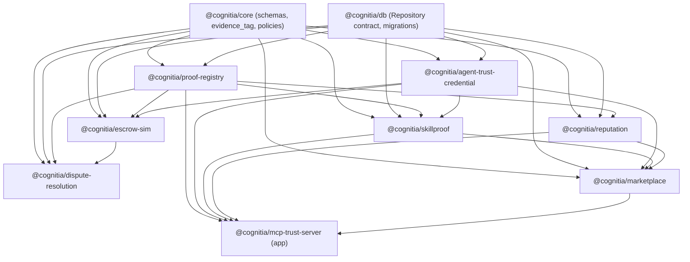

# Agent Economy — Architecture Gap Report & 100-Point Readiness Plan

- **Document ID:** AGENT-ECONOMY-READINESS-100
- **Date:** 2026-06-23
- **Status:** Draft / planning. Not doctrine. Subordinate to `docs/cognitia/ARCHITECTURE_LOCK_V1_1.md`.
- **Author role:** Protocol architect (audit + plan only; no code in this deliverable)
- **Base branch audited:** `origin/overnight/gtm-implementation` (HEAD `da48e8f`)

---

## 0. Scope, framing, and constraints

**Framing (important).** Canonical Cognitia/Demandara product infrastructure
already exists on `overnight/gtm-implementation`: a pnpm + TypeScript monorepo
(`apps/{api,web,worker}`, `packages/{core,db,agents,integrations,evals,workflows}`,
~580 files, 500+ tests). **This report audits only the Agent Economy layer**
("Cognitia Republic" in the roadmap brief). That layer is **already
implemented as a simulation-only lab** — but it has **no dedicated package
architecture**: its logic lives inside `@cognitia/core` (schemas),
`@cognitia/db` (SQL migrations), and `apps/api/src/*` (service handlers). The
central gap this plan closes is **extraction + hardening into clean,
doctrine-named packages**, plus the few genuinely-missing capabilities.

**Terminology note.** The roadmap brief uses the label "Cognitia Republic."
That term appears in **zero** repo docs; the canonical internal term is the
**Agent Economy / platform (proof-backed) economy** (see
`docs/cognitia/agent-economy/AGENT_ECONOMY_LAB.md` and Architecture Lock
Amendment A1). This report uses the canonical term and treats "Cognitia
Republic" as the brief's alias for it. No new public name is claimed.

**Hard constraints reflected throughout (and already enforced in-repo).**
No token launch · no investment/return/appreciation/price language · no live
payments · no real wallet transactions · no real distributed execution · no
fake users/logos/metrics/integrations · no legal claims beyond docs/specs.
Escrow is **simulation-only internal credits** (`escrow-sim`). The token track
is **internal, legal-gated, docs-only**; all 8 token gates are **NOT PASSED**
(`docs/cognitia/crypto/TOKEN_GATES.md`). These are not aspirations here — they
are existing locked doctrine (`ARCHITECTURE_LOCK_V1_1.md` §3, §5, §6, §7).

**Naming reconciliation (binding doctrine vs. brief).** Two package names in
the brief collide with `ARCHITECTURE_LOCK_V1_1.md` §1 and MUST NOT be used as
code/package identifiers:

| Brief name (requested)      | Doctrine-compliant package name        | Why                                                                                  |
| --------------------------- | -------------------------------------- | ------------------------------------------------------------------------------------ |
| `packages/agent-passport`   | **`@cognitia/agent-trust-credential`** | "Agent Passport" is internal shorthand only, **forbidden** in code/public (§1, A1). Code uses `atc`. |
| `packages/skill-registry`   | **`@cognitia/skillproof`**             | "Skill Registry" is **forbidden**; we *certify*, not catalog (§1, §3). Public name is SkillProof. |
| `packages/proof-registry`   | `@cognitia/proof-registry`             | Matches doctrine ✓                                                                   |
| `packages/reputation`       | `@cognitia/reputation`                 | Matches ✓                                                                            |
| `packages/escrow-sim`       | `@cognitia/escrow-sim`                 | Matches doctrine + simulation discipline ✓                                           |
| `packages/dispute-resolution` | `@cognitia/dispute-resolution`       | Matches ✓                                                                            |
| `packages/marketplace`      | `@cognitia/marketplace`                | Matches ✓ (internal-only)                                                            |
| `packages/mcp-trust-server` | `@cognitia/mcp-trust-server`           | New; read-only MCP exposure of existing trust primitives                             |

The 8 capability domains in the brief are preserved; only the two forbidden
identifiers are renamed. The rest of this report uses the doctrine-compliant
names.

---

## 1. What exists in the current repo (implemented)

The Agent Economy is a **production-grade, simulation-only lab**, runtime-verified
by tests and a pilot proof harness. Every value-moving action is triple-gated
(zod schema → Postgres trigger/CHECK → service-layer mirror).

| Capability | State | Schema / Types | DB migration | Service / API | Tests |
| --- | --- | --- | --- | --- | --- |
| **Agent Trust Credential (ATC)** | Built (W3C-VC *shape*; no crypto suite) | `packages/core/src/schemas/trust.ts` | `0009_cognitia_trust_core.sql` | `apps/api/src/atc.ts` | `atc.test.ts` |
| **Agent registry + permissions / multi-model governance** | Built (deny-by-default policy; proof-gated release gates; deterministic model/agent routing via fabric) | `trust.ts` | `0009` | embedded in handlers; `agentFabric.ts` | covered |
| **Proof Registry** | Built (append-only, evidence-tagged, redaction-gated) | `trust.ts` | `0009` | `apps/api/src/proofs.ts` | `proofs.test.ts` |
| **SkillProof + tiers** | Built (Core-20 seed; T≥2 needs `verified_fact`) | `trust.ts` / `economy.ts` | `0010`, `0013` | `apps/api/src/skillproof.ts` | `skillproof.test.ts` |
| **Reputation v0** | Built (append-only; +Δ only on `verified_fact`; reproducible snapshots) | `trust.ts` | `0010` | `apps/api/src/reputation.ts` | `reputation.test.ts` |
| **Internal credits ledger** | Built (double-entry, append-only, idempotent) | `trust.ts` | `0012` | `apps/api/src/credits.ts` | `credits.ledger.test.ts` |
| **Escrow (simulation)** | Built (reserve→release/refund/dispute; release only on `verified_fact`) | `economy.ts` | `0016` | `apps/api/src/agentEconomy.ts` | `agentEconomy.test.ts` |
| **Work orders + sim skill execution** | Built (`simulation=true` check-locked) | `economy.ts` | `0016` | `agentEconomy.ts`, `agentEconomyActions.ts` | covered |
| **Dispute resolution** | Built (owner-arbitrated; release/refund/split; resolution proof required) | `economy.ts` | `0017` | `agentEconomy.ts` | `disputeResolution.test.ts` |
| **Marketplace (internal)** | Built (tier-aware match; yanked-skill guard; visibility check-locked `internal`) | `economy.ts` | `0018` | `apps/api/src/marketplace.ts` | `marketplace.test.ts` |
| **Agent Fabric (simulation)** | Built (node registry + deterministic routing + sim receipts) | `economy.ts` | `0019` | `apps/api/src/agentFabric.ts` | `agentFabric.test.ts` |
| **Trust metrics / packet / public trust feed** | Built (redaction-gated public view) | — | — | `trustMetrics.ts`, `trustPacket.ts` | `trustMetrics.test.ts`, `publicTrustFeed*.test.ts` |
| **Pilot Proof Harness** | Built (6 scenario paths over mainline primitives) | — | — | — | `pilotProofHarness.test.ts` |

**Reusable patterns to build on:**
- The Hermes vision skill (`hermes/skills/vision-skill/`) is the in-house
  **MCP + privacy-proof pattern** (Architecture Lock §4, §6) — referenced only;
  not modified by this plan.
- Triple-enforcement (`zod` + DB trigger + service mirror) is the established
  invariant pattern; new packages must preserve it.
- Append-only + `supersedes_*` corrections; `evidence_tag` discipline;
  `public_safe` default-deny redaction.

**Self-assessed baseline** (`docs/cognitia/audits/AUDIT_BOOKLET_001/READINESS_SCORECARD.md`):
agent-economy readiness 4/5; marketplace 3/5; distributed fabric 2/5;
managed-provider RLS 3/5; token launch 0/5 *by design*.

---

## 2. What is only docs/spec (designed, not built)

| Item | Doc | Status |
| --- | --- | --- |
| **Cross-tenant settlement** (tenant A hires tenant B; clearing tenant) | `agent-economy/CROSS_TENANT_SETTLEMENT_DESIGN.md` | Design only; multi-tenant token gate #3 NOT PASSED. Economy is single-tenant. |
| **Real distributed execution** (Tailscale/cloud routing, networked stages) | `research/distributed-agent-fabric/*` | Design only; only simulation Lab v0 built. Stage 2+ gated by security sign-off. |
| **MCP / A2A exposure of skills** | Architecture Lock §4 | Pattern documented (Hermes); **no MCP server code** in monorepo. |
| **Standards anchoring** (ERC-8004 IDs, EAS attestations, W3C-VC crypto suites) | Architecture Lock §4; `public/STANDARDS_ALIGNMENT.md` | Fields reserved (`external_ref`, `external_attestation_ref`) but **not integrated**. Deferred by design. |
| **Stripe / stablecoin payment rails** | Architecture Lock §5 | Enum placeholders only; CHECK-locked to `internal_credits`. No code. |
| **Wallet activation** | `CREDITS_AND_WALLET_PLACEHOLDERS.md`; `0014_wallet_binding_deactivate.sql` | Inert placeholder; `status` check-locked to `placeholder`. No signing/custody. |
| **Token** | `crypto/TOKEN_*` | Internal, legal-gated, docs-only. All 8 gates NOT PASSED; may never launch. |

---

## 3. What is missing (true gaps to close)

1. **No dedicated package architecture for the Agent Economy.** All logic is
   embedded in `apps/api/src/*` handlers + `@cognitia/core` schemas + `@cognitia/db`
   migrations. There are no `@cognitia/proof-registry`, `escrow-sim`, etc.
   packages. This couples economy domain logic to the Fastify app and blocks
   reuse by `worker`, `web`, evals, and a future MCP server. **This is the
   primary gap.**
2. **No MCP trust server.** Nothing exposes ATC / proofs / SkillProof / trust
   metrics over MCP, despite the documented intent and the Hermes precedent.
3. **No service-layer extraction boundary.** Handlers mix HTTP concerns
   (auth, rate-limit, routing) with domain logic; domain logic should be
   framework-agnostic package functions the handlers call.
4. **Hardening gaps (all tracked in the scorecard):** managed/hosted-provider
   RLS unverified; no external security audit; observability/metrics on
   economy flows thin; redaction-check coverage should be asserted per public
   surface.
5. **Web surfaces partial:** `/agent-economy`, `/proofs`, `/skills`, `/trust`,
   `/credits`, `/marketplace` routes exist but detail/clarity vary
   (marketplace detail pages noted as future).

Out of scope as gaps (deliberately gated, not deficiencies): real payments,
token, real distributed execution, cross-tenant settlement, crypto anchoring.

---

## 4. 100-point Agent Economy readiness score (weighted rubric, 8 packages)

**Method.** 100 points distributed across the 8 target packages by importance.
Each package is scored on five slices: **Spec/doctrine (20%) · Schema & types
(20%) · Service & API impl (25%) · Tests (15%) · Package extraction +
production hardening (20%)** of its weight. "100" means: each capability is a
clean, doctrine-named, independently-tested package with hardened
boundaries — **entirely within** the simulation-only / no-token / no-live-payment
constraints. Token, real payments, real distributed execution, and cross-tenant
settlement are explicitly **excluded from the 100** (they are future-gated
tracks, see §8).

| # | Package | Weight | Current | Scored (what exists) | Missing (to reach weight) |
| --- | --- | ---: | ---: | --- | --- |
| 1 | `@cognitia/proof-registry` | 16 | 12 | Spec, schema, append-only DB w/ triggers, service, tests | Extract from `apps/api`; harden redaction-check assertions |
| 2 | `@cognitia/agent-trust-credential` | 14 | 10 | Spec, VC-shape schema, ATC lifecycle, gating, tests | Extract to package; observability; standards-ref mapping (no integration) |
| 3 | `@cognitia/escrow-sim` | 14 | 11 | Full reserve/release/refund/dispute lifecycle, triple-gated, tests | Extract; explicit sim-boundary module + invariants doc |
| 4 | `@cognitia/skillproof` | 12 | 9 | Core-20 seed, tier guard (T≥2 `verified_fact`), service, tests | Extract; tier-upgrade flow hardening |
| 5 | `@cognitia/marketplace` | 12 | 8.5 | Internal listings, tier-aware match, yank guard, tests | Extract; matching as pure function; web detail surface |
| 6 | `@cognitia/mcp-trust-server` | 12 | 2 | Hermes MCP pattern + read-only trust data exist | Build the server (read-only): expose ATC/proofs/SkillProof/metrics |
| 7 | `@cognitia/reputation` | 10 | 7.5 | Append-only events, `verified_fact`-gated +Δ, snapshots, tests | Extract; deterministic snapshot module |
| 8 | `@cognitia/dispute-resolution` | 10 | 7.5 | Owner arbitration, release/refund/split, resolution proof, tests | Extract; arbitration math as pure conserved function |
| | **Total** | **100** | **≈ 68** | Production-grade lab, fully embedded | Package extraction + MCP server + hardening |

**Current readiness ≈ 68/100.** The shortfall is overwhelmingly *architectural*
(extraction + the missing MCP server), not *functional*. The economy loop works
and is tested; it is simply not yet a set of clean, reusable, doctrine-named
packages.

---

## 5. Proposed package / module boundaries

New workspace area: `packages/agent-economy/*` (or flat `packages/*`; flat
recommended for consistency with existing `@cognitia/*`). All are libraries
(no servers) **except** `mcp-trust-server`. Each package: framework-agnostic
domain logic + zod types re-exported from `@cognitia/core`, with `apps/api`
handlers reduced to thin adapters that call the package. The DB stays in
`@cognitia/db` (single migration source of truth); packages depend on the
`Repository` contract, never on `pg` directly.

Per-package boundary (purpose · key surface · deps · non-goals):

1. **`@cognitia/proof-registry`** — append-only proofs with `evidence_tag`,
   redaction gate, `supersedes`. Surface: `createProof`, `supersedeProof`,
   `assertRedactionPassed`, `getPublicSafeProofs`. Deps: core, db. Non-goals:
   no destructive edits; no PII in `public_safe`; no on-chain anchoring (reserved field only).
2. **`@cognitia/agent-trust-credential`** — ATC issue/suspend/revoke/expire;
   agent registry; deny-by-default permission checks. Surface: `issueAtc`,
   `setAtcStatus`, `requireActiveAtc`, `checkPermission`. Deps: core, db.
   Non-goals: no `did:cognitia`; no VC crypto suite; no "passport" identifier.
3. **`@cognitia/skillproof`** — Core-20 skills, versions, proof tiers (T0–T4,
   T≥2 ⇒ `verified_fact`; T3/T4 not assignable). Surface: `registerSkillVersion`,
   `certifyTier`, `yankVersion`. Deps: core, db, proof-registry. Non-goals: no
   public "registry"; visibility `internal`.
4. **`@cognitia/reputation`** — append-only events (+Δ only on `verified_fact`),
   reproducible snapshots (`inputs_hash`). Surface: `recordEvent`,
   `computeSnapshot`. Deps: core, db, proof-registry. Non-goals: no leaderboards,
   no decay/weights in v0, no transfer.
5. **`@cognitia/escrow-sim`** — simulation-only internal-credits escrow:
   reserve→release/refund/dispute; release only against `verified_fact`.
   Surface: `reserveForWorkOrder`, `release`, `refund`, `markDisputed`. Deps:
   core, db, proof-registry. Non-goals: **no real payments**; no rail other than
   `internal_credits`; idempotent ledger pairs only.
6. **`@cognitia/dispute-resolution`** — owner arbitration; conserved
   release/refund/split; resolution `verified_fact` proof required. Surface:
   `resolveDispute(decision)`, pure `conservedSplit()`. Deps: core, db,
   escrow-sim, proof-registry, reputation. Non-goals: no automated verdicts.
7. **`@cognitia/marketplace`** — internal listings; pure
   `matchScore = tier*1000 + reputation*10 + verifiedOrders`; yank/ATC guards;
   order-from-listing. Surface: `listSkillVersion`, `rankListings`,
   `orderFromListing`. Deps: core, db, skillproof, reputation, atc. Non-goals:
   visibility `internal` only; prices are internal credits; no real payments.
8. **`@cognitia/mcp-trust-server`** *(app)* — **read-only** MCP server exposing
   trust primitives (ATC status, public-safe proofs, SkillProof tiers, trust
   metrics) following the Hermes MCP pattern. Tools: `get_atc_status`,
   `list_public_proofs`, `get_skill_tier`, `get_trust_metrics`. Deps: core, db,
   proof-registry, atc, skillproof. Non-goals: **read-only** (no value movement,
   no escrow/dispute writes); respects redaction gate; no PII.

---

## 6. Phased milestones to 100

| Phase | Packages | Adds | Cumulative |
| --- | --- | --- | --- |
| **P1 — Foundation extraction** | proof-registry, agent-trust-credential | Extract + harden; redaction assertions; observability | ≈ 68 → 80 |
| **P2 — Value-loop extraction** | escrow-sim, skillproof, reputation, dispute-resolution | Extract; pure conserved/snapshot/match functions | 80 → 92 |
| **P3 — Surfaces** | marketplace, mcp-trust-server | Extract marketplace + matching; build read-only MCP server | 92 → 100 |

Each phase keeps triple-enforcement, adds no new public claims, and stays
within simulation-only / no-token / no-live-payment limits. (Managed-provider
RLS, external audit, cross-tenant, real exec, crypto anchoring, token = §8
future tracks, beyond this 100.)

---

## 7. Exact next builder prompts (8 — one per package)

> Each prompt is self-contained and copy-pasteable. Common preamble applies to
> all: *Work on branch off `overnight/gtm-implementation`. Obey
> `docs/cognitia/ARCHITECTURE_LOCK_V1_1.md`. Preserve triple-enforcement (zod +
> DB trigger + service mirror). Do not edit migrations `0001–0008`. Do not edit
> `hermes/`. No token, no real payments, no live wallet/SMS, no PII in
> `public_safe`, no investment/return/price language. Extract domain logic from
> `apps/api/src/*` into the new package and reduce the handler to a thin adapter
> that imports it; keep all existing tests green and add package-level tests.*

1. **proof-registry** — "Create `packages/proof-registry` (`@cognitia/proof-registry`).
   Move the append-only proof logic out of `apps/api/src/proofs.ts` into pure,
   Repository-backed functions: `createProof`, `supersedeProof`,
   `assertRedactionPassed`, `getPublicSafeProofs`. Keep `evidence_tag` rules
   and the `public_safe` default-deny redaction gate. Add tests asserting:
   `verified_fact` requires evidence+verifier; no `public_safe=true` without a
   passed redaction check; append-only (no destructive edit)."

2. **agent-trust-credential** — "Create `packages/agent-trust-credential`
   (`@cognitia/agent-trust-credential`). Extract ATC lifecycle + agent registry +
   deny-by-default permission checks from `apps/api/src/atc.ts` into
   `issueAtc`, `setAtcStatus`, `requireActiveAtc`, `checkPermission`. Keep the
   W3C-VC *shape* with no crypto suite and no `did:cognitia`; `external_ref`
   stays a reserved nullable mapping field. Use the name `atc` only — never
   'passport' in any identifier. Tests: economy actions blocked without an
   ACTIVE ATC; explicit deny wins."

3. **escrow-sim** — "Create `packages/escrow-sim` (`@cognitia/escrow-sim`).
   Extract the simulation-only internal-credits escrow from
   `apps/api/src/agentEconomy.ts`: `reserveForWorkOrder`, `release`, `refund`,
   `markDisputed`, over the append-only double-entry ledger. Enforce: release
   only against a `verified_fact` proof; idempotent ledger pairs; rail locked to
   `internal_credits`. Add an explicit `SIMULATION-ONLY` invariants module.
   Tests must prove release is impossible without a `verified_fact` proof."

4. **skillproof** — "Create `packages/skillproof` (`@cognitia/skillproof`).
   Extract skills/skill-versions/tier certification from
   `apps/api/src/skillproof.ts`: `registerSkillVersion`, `certifyTier`,
   `yankVersion`. Enforce T≥2 ⇒ linked proof `evidence_tag='verified_fact'`;
   T3/T4 not assignable; visibility `internal`; yanked versions take no new work.
   Name is SkillProof — never 'skill registry'. Tests cover the tier guard and
   yank behavior."

5. **reputation** — "Create `packages/reputation` (`@cognitia/reputation`).
   Extract from `apps/api/src/reputation.ts`: append-only `recordEvent` and a
   deterministic `computeSnapshot` with `inputs_hash`. Enforce: positive deltas
   require a `verified_fact` proof; no decay/weights/leaderboards in v0.
   Tests: positive delta rejected without `verified_fact`; identical event sets
   produce identical snapshot hashes."

6. **dispute-resolution** — "Create `packages/dispute-resolution`
   (`@cognitia/dispute-resolution`). Extract owner-arbitrated resolution from
   `apps/api/src/agentEconomy.ts`: `resolveDispute(decision)` for
   release/refund/split plus a pure `conservedSplit()` (worker+requester =
   requested). Require a `verified_fact` RESOLUTION proof before status
   `resolved`; apply reputation rules (refund ⇒ −; vindication ⇒ + only if
   delivery was `verified_fact`; split ⇒ none). Tests cover conserved math and
   the proof gate."

7. **marketplace** — "Create `packages/marketplace` (`@cognitia/marketplace`).
   Extract from `apps/api/src/marketplace.ts`: `listSkillVersion`,
   pure `rankListings` (`tier*1000 + reputation*10 + verifiedOrders`,
   `eligible = tier>=2`), `orderFromListing`. Enforce visibility `internal`
   only; yanked skills cannot list; one listing per agent/skill-version; prices
   are internal credits with no real-payment path. Tests cover ranking order
   and the yank/visibility guards."

8. **mcp-trust-server** — "Create `apps/mcp-trust-server`
   (`@cognitia/mcp-trust-server`): a **read-only** MCP server following the
   Hermes vision-skill MCP pattern. Expose tools `get_atc_status`,
   `list_public_proofs`, `get_skill_tier`, `get_trust_metrics`, backed by the
   proof-registry / atc / skillproof packages. Strictly read-only — no escrow,
   dispute, credits, or any write tool. Return only redaction-passed,
   `public_safe` data; never PII. Add tests asserting no write capability and
   that only public-safe proofs are returned."

---

## 8. Risks, open questions, and explicit non-goals

**Risks / open questions**
- **Naming conflict (resolved here):** brief's `agent-passport` / `skill-registry`
  are forbidden by Architecture Lock §1. This plan renames them to `atc` /
  `skillproof`. Confirm acceptance before extraction PRs.
- **Extraction risk:** moving logic out of `apps/api` must keep DB triggers as
  the source of truth; packages mirror, never replace, the triggers.
- **Repository contract coupling:** packages should depend on the
  `@cognitia/db` Repository interface (in-memory + Postgres), not `pg`.
- **Managed-provider RLS** remains unverified (scorecard row 4); not blocking
  this plan but gates real pilots.

**Explicit non-goals (future-gated tracks, excluded from the 100)**
- Token (all 8 gates NOT PASSED; internal/legal-gated, docs-only; may never launch).
- Real payments / Stripe / stablecoin rails (enum placeholders only).
- Wallet activation, signing, custody (inert placeholder, check-locked).
- Real (non-simulated) distributed execution; Tailscale/cloud routing.
- Cross-tenant settlement / clearing tenant (design only; gate #3 NOT PASSED).
- On-chain anchoring (ERC-8004 / EAS); W3C-VC crypto suites — reserved fields only.

No financial, investment, return, appreciation, or price language appears in
this document, and none is to be introduced by the work it plans.

---

## 9. Verification (for the extraction work this plan proposes — later, on approval)

- `pnpm -w typecheck && pnpm -w test` stays green; new package tests added per §7.
- Each new package builds independently and is consumed by `apps/api` adapters.
- Grep guards: no `did:cognitia`; no `passport`/`skill registry` identifiers;
  no `stripe`/`stablecoin`/`token` write paths; no price/return/yield language.
- Economy smoke + pilot proof harness (`apps/api/src/economySmoke.live.test.ts`,
  `pilotProofHarness.test.ts`) still pass after extraction.
- `mcp-trust-server` exposes only read tools (asserted by test).
